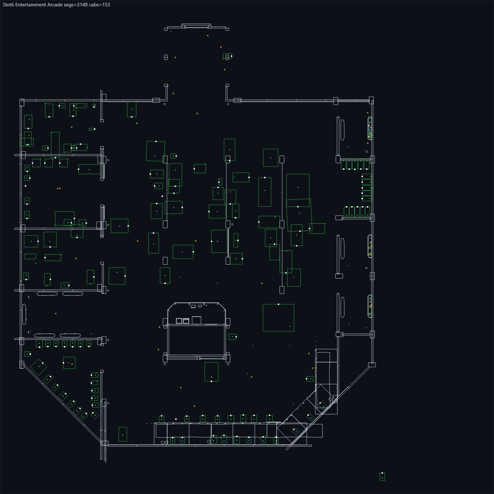

# Arcade Designer

A top-down room editor for **EmuVR** arcades. Open one of your saved rooms and see it as a floor plan, with the building's walls and every cabinet drawn at its real size. The white dot on each cabinet shows which way its screen faces. You can then move, turn, resize, restock and tidy the room from your desk instead of in VR.

It edits the same `Saved Data\Rooms\Slot<N>.json` files EmuVR uses, and it makes a timestamped backup every time you save.

> **No piracy.** I don't condone piracy. This project contains no games, ROMs, BIOS files or other copyrighted content, and it doesn't link to or help you get any. Only use games, ROMs and BIOS files you have legally sourced and have the right to use — for example, dumps of cartridges, discs and boards you own.



---

## What it does

**Floor plan**
- **Walls:** drawn automatically from the room's level model (Flynn's, Neon Arcade, Atlantis, Warehouse, Arcade Club, Entertainment Arcade and many more).
- **Traced walls:** rooms without a level model can have walls traced by hand.
- **Cabinets and props:** drawn at their real footprint, taken from each model's own mesh and the room's scale.
- **White dot:** marks the front, i.e. the side the screen faces. This is the side you stand on to play. It's read from each model's screen, so it's right even for models built facing sideways.
- **Colours:**
  - green = game file found;
  - red = game missing, with the reason shown in the side panel;
  - grey = unknown or decoration;
  - an orange outline means two things overlap.

**Editing**
- **Move and turn:** drag cabinets to move them; turn them with the **direction dial** or the keyboard.
- **Scale:** a logarithmic slider with a tick at the size that model normally uses in other rooms, and a readout of how tall it will stand in VR. A warning appears when a cabinet would be giant or tiny.
- **Game:** change a cabinet's game from your library. Each entry is checked, including TeknoParrot, Model 2, Model 3 and Daphne capture launchers, so you can see which games will actually launch.
- **Model:** swap to another cabinet model, or place new models from the library.
- **Duplicate and delete:** these keep EmuVR's screen numbering intact, so the room still loads.
- **Align a row:** line up the selected cabinets.
- **Undo / redo** for everything.

**Saving safely**
- **Validation first:** the room is checked before anything is written.
- **Backups:** the current file is copied to `Slot<N>.json.bak-<date>-<time>` first.
- **Out-of-date copy:** you get a warning if the room changed on disk since you opened it, for example because you saved it in VR.
- **EmuVR format:** files are written without a byte-order mark, which EmuVR needs.
- **Traced walls:** kept in their own files, never in the room.

---

## Requirements

| What | Why |
|---|---|
| Windows 10 or 11 | EmuVR and the helper scripts are Windows-only |
| An EmuVR install | Any install; big UGC packs such as RAVE work well |
| **Google Chrome** or **Microsoft Edge** | The editor needs the browser's folder-access feature to read and save rooms (Firefox can only use the limited fallback mode) |
| [Node.js](https://nodejs.org) 22 or newer | Only for the one-off setup tools and the tests; the editor itself runs in the browser |

---

## Installation

1. **Close EmuVR.**
2. **Put the editor inside your EmuVR folder** — the folder that contains `Saved Data` and `Custom`. **The folder must be called `RoomEditor`**:
   ```bat
   cd /d "D:\EmuVR"
   git clone https://github.com/benswana/EmuVR_Simple_Arcade_Designer.git RoomEditor
   ```
   Or download the ZIP from GitHub, extract it, and rename the extracted folder to `RoomEditor`.

   You should end up with:
   ```
   D:\EmuVR\
     Custom\
     Games\
     Saved Data\
     RoomEditor\     <- this project
   ```
3. **Build the shape data for your own models and levels.** This takes about a minute:
   ```bat
   cd /d "D:\EmuVR\RoomEditor"
   node tools\extract_models.mjs
   node tools\extract_walls.mjs --all
   ```
   - `extract_models` reads every model in `Custom\UGC` and records its real size and which way its screen faces. It writes `models\index.json`.
   - `extract_walls` slices each level model at waist height to get its walls. It writes `walls\levels\`.

   This data is built from the content in your own EmuVR folder, so it isn't included in this repository.
   - **Without it,** the editor still works, but cabinets are drawn as guessed boxes with no front dots, and level walls aren't shown.
   - **Run both commands again** whenever you add new UGC cabinets or levels.
4. **Start the editor:** double-click `tools\Start RoomEditor.cmd`. It starts a small local web server on `http://localhost:8765` and opens the editor in your browser. Leave the black window open while you work; close it when you're done.
5. **Open your room:**
   1. Click **Pick EmuVR folder** and choose your EmuVR folder (for example `D:\EmuVR`).
   2. Allow the browser to view and save files.
   3. Type a slot number and click **Load**.

---

## Using it

### On the plan
| Action | How |
|---|---|
| Pan | Drag an empty area |
| Zoom | Mouse wheel |
| Select | Click a cabinet (Shift+click to add more) |
| Move | Drag a selected cabinet (snaps to 10 cm; hold **Alt** for no snapping) |
| Turn 90° | **R** / **Shift+R** |
| Turn 5° | **[** and **]** |
| Line up a row | Select several cabinets, then **Align row (Z)** |

### Side panel (one cabinet selected)
- **Game:** pick any game found in your `Games` folders. Suggestions matching the cabinet are listed below it.
- **Model:** search and swap the cabinet model. The scale is set to that model's usual size.
- **Scale:** drag the bar or type a number. The orange tick marks the size the model normally uses, and the text above tells you how tall it will stand in VR.
- **x / y (height) / z:** exact position in metres.
- **Direction dial:** drag the needle to turn the cabinet; the needle points where the screen faces. It snaps every 15°; hold **Shift** to turn freely. The number box sets an exact facing.
- **Frozen:** leave this ticked. In EmuVR an unfrozen object is in edit mode, and its game and attract video won't run.
- **Duplicate / Delete.**

### Adding models
Search the library at the bottom of the side panel, click **Place selected model**, then click on the plan where it should go.

### Walls
- **Level walls** (solid grey) load automatically when the room uses a level model.
  - The status bar names the level, or says why no walls are shown. For example, a level placed at a scale other than 1 can't be drawn accurately.
- **Traced walls** (dashed blue): for rooms without a level model, or to add your own guides.
  1. Click **Trace walls**, then click corners on the plan.
  2. Hold **Shift** to keep a wall straight.
  3. Press **Enter** or double-click to finish a wall, and **Backspace** to remove the last corner.
  4. Press **Esc** or click **Done tracing** to stop.
  5. Click **Save walls** to keep them. They're stored in `RoomEditor\walls\traced\`, never in the room file.

### Saving
Click **Save**. The room is validated, the current file is backed up next to it, and then it's written. After saving, use **Load Room** in EmuVR to see the changes.

### Legend
| Mark | Meaning |
|---|---|
| Green outline | Game file found |
| Red outline | Game missing — the side panel says why |
| Grey outline | Unknown launcher, or a decoration with no game |
| Orange outline | Overlaps another object |
| White dot | Front of the cabinet (the screen side) |
| Grey ring | Front unknown (models without a screen, such as consoles and props) |
| Grey lines | Walls from the level model |
| Dashed blue lines | Your traced walls |

---

## Tips

- **Save in one place at a time.** EmuVR reads a room when you load it and overwrites the file when you save from VR. Either save from the editor and then **Load Room** in EmuVR, or save in VR and then reload in the editor. The editor warns you if the file changed underneath it.
- **A scale number isn't a size.** Each model is built in its own units: one built in centimetres is normal size at `0.01`, while one built in metres is normal at `1`. Trust the "stands … m tall in VR" readout and the orange tick, not the number.
- **The height (y) is the model's pivot, not its base.** Most cabinets have the pivot at the floor, but some have it in the middle. If one cabinet in a row sinks into the floor or floats, raise or lower its y by the difference rather than copying its neighbour's value.
- **Keep game swaps within the same system folder.** Put a MAME game on a MAME cabinet, a capture launcher on a capture cabinet. Themed cabinets (light-gun, driving, sit-down) are built for one game; their artwork won't match anything else.
- **Delete from the editor, not by hand-editing the JSON.** EmuVR pairs every screen number exactly twice, and the editor keeps that pairing when you delete or duplicate.
- **Restoring a backup:** close EmuVR, then copy a `Slot<N>.json.bak-…` file over `Slot<N>.json`.
- **Check your changes as a picture:**
  ```bat
  node tools\render_walls.mjs --slot 6 --cell 1800 --cols 1 --per 1
  ```
  This saves a PNG of the room's walls, footprints and front dots. It needs Chrome; set `CHROME_PATH` if Chrome isn't in the default location.
- **Fallback mode** (Firefox, or opening the file directly): run `powershell -File tools\gen_manifest.ps1` once, then open `RoomEditor.html`. Saving downloads the room file instead of writing it in place.

---

## Troubleshooting

| Problem | Fix |
|---|---|
| Buttons do nothing / can't pick a folder | Start the editor with `tools\Start RoomEditor.cmd` in Chrome or Edge rather than opening the HTML file directly |
| "Address already in use" in the black window | Another copy is already running; close it first |
| Changes don't show in VR | Use **Load Room** in EmuVR after saving; don't save the room in VR in between |
| A game shows **dead – file not found** | The game file (or the shortcut/symlink pointing to it) is missing from `Games\<System>`; check that it opens in Explorer |
| "TeknoParrot game file not verifiable from the browser" | The game lives outside the EmuVR folder, so the browser can't see it; it may still work in VR |
| `walls: none — use Trace walls` | The room doesn't use a level model, or `extract_walls` hasn't been run for it |
| Cabinet shows a grey ring instead of a white dot | The model has no screen (consoles, props), or `extract_models` hasn't been run since the model was added |
| Cabinet outlines look like guessed boxes | `models\index.json` is missing — run `node tools\extract_models.mjs` |
| The editor shows an old version after an update | Close the browser tab and start `tools\Start RoomEditor.cmd` again |

---

## Tools

| Script | What it does |
|---|---|
| `tools\Start RoomEditor.cmd` | Starts the local server and opens the editor |
| `tools\serve.ps1` | The local web server (port 8765) |
| `tools\extract_models.mjs` | Builds `models\index.json`: real size and screen direction of every UGC model |
| `tools\extract_walls.mjs --all` | Builds `walls\levels\*.json`: wall outlines of every level model |
| `tools\render_walls.mjs` | Renders rooms (walls, footprints, front dots) to PNG for checking |
| `tools\verify_room.ps1 -Path <room.json>` | Checks a room file: no BOM, valid JSON, every screen number paired |
| `tools\gen_manifest.ps1` | Writes `manifest.js` for fallback mode |
| `tools\build.ps1` | Rebuilds the single-file `RoomEditor.html` from `index.html` and `src\` |
| `tools\smoke.mjs` | Loads both pages in headless Chrome and reports any errors (start the server first) |

The helper tools find your EmuVR folder automatically, because it sits one level above `RoomEditor`. Set the `EMUVR_DIR` environment variable to point them somewhere else.

## Running the tests

```bat
cd /d "D:\EmuVR\RoomEditor"
npm test
```

Some tests read real files from an EmuVR install and are skipped when those files aren't present.

---

## Legal

- **No games included.** Arcade Designer only reads and writes EmuVR room layout files and reads the model and level files already in your EmuVR folder. It includes no games, ROMs, BIOS files or copyrighted artwork.
- **No model or level data included.** The size, facing and wall data it uses is generated on your own PC from content you installed, and is never distributed.
- **No piracy.** I don't condone piracy. Legally source every game, ROM and BIOS file you use.
- **Trademarks.** EmuVR, game titles and cabinet names belong to their respective owners.

## Licence

Copyright (C) 2026 benswana

This program is free software: you can redistribute it and/or modify it under the terms of the GNU General Public License as published by the Free Software Foundation, either version 3 of the License, or (at your option) any later version. It is distributed in the hope that it will be useful, but WITHOUT ANY WARRANTY; without even the implied warranty of MERCHANTABILITY or FITNESS FOR A PARTICULAR PURPOSE. See [LICENSE](LICENSE) for the full text.

*Not affiliated with EmuVR. Always keep backups of rooms you care about.*
